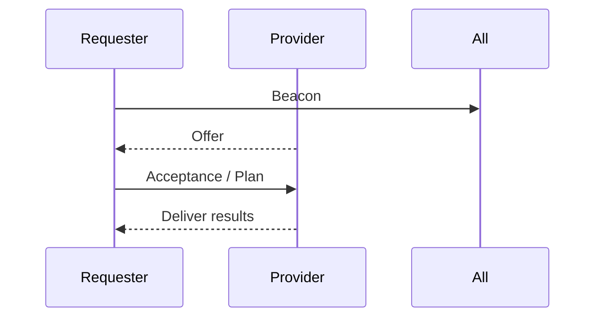

# 0 – Overview

Plan-Spec defines a small set of interoperable JSON objects that let
independent software agents *discover*, *negotiate*, and *execute* work.

`Beacon → Offer → Plan` is the canonical flow:

All objects are wrapped in a SignedEnvelope to guarantee provenance.

## Core Objects

### Beacon
A **Beacon** represents a request for work. It contains:
- Unique identifier (`beaconId`)
- Human-readable title and description
- Trust requirements (`minTrust`)
- Expiration timestamp
- Optional tags for categorization

### Offer
An **Offer** is a proposal to fulfill a Beacon. It includes:
- Reference to the target beacon (`beaconId`)
- Provider's decentralized identifier (`providerDid`)
- Pricing in USD (`priceUsd`)
- License terms (`licenseUri`)
- Validity period (`validUntil`)

### Plan
A **Plan** describes the execution strategy for accepted work as a directed acyclic graph (DAG) of tasks:
- Unique identifier (`planId`)
- Reference to originating beacon (`beaconId`)
- Optional escrow identifier (`escrowId`)
- Array of interconnected tasks

### Capability
A **Capability** advertises an agent's skills and availability:
- Unique identifier (`capabilityId`)
- Agent's decentralized identifier (`agentDid`)
- Skill tags for matching
- Optional pricing information

### SignedEnvelope
All objects are wrapped in a **SignedEnvelope** that provides:
- Sender identification (`senderDid`)
- Timestamp (`sentAt`)
- Payload type classification (`payloadType`)
- Cryptographic signature (`sig`)
- Tamper-evident integrity

## Example Flow

1. **Discovery**: Agent A publishes a Beacon describing needed work
2. **Negotiation**: Agent B responds with an Offer proposing fulfillment
3. **Planning**: Upon acceptance, a Plan is created detailing task execution
4. **Execution**: Tasks are assigned to capable agents and executed according to dependencies
5. **Completion**: Results are delivered and verified

This specification enables decentralized, multi-agent coordination while maintaining security and trust through cryptographic signatures and decentralized identifiers.
